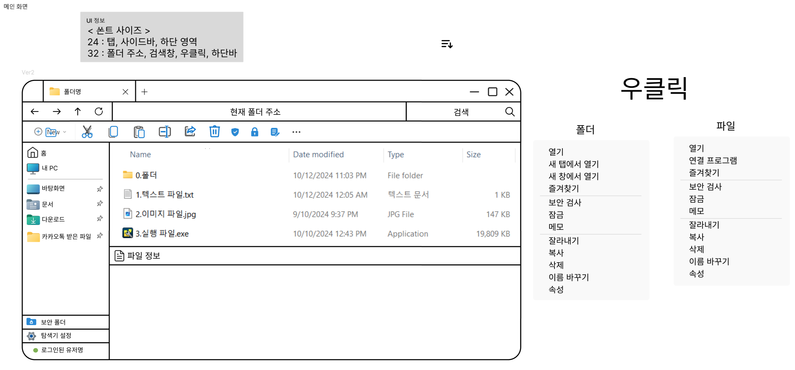
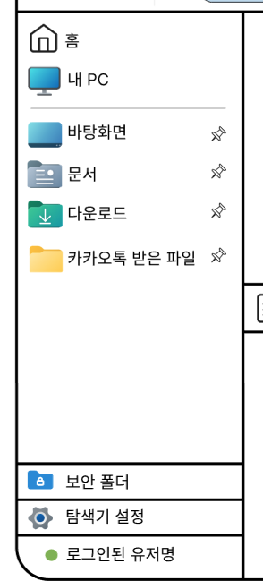
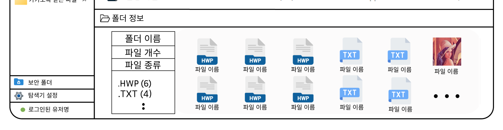
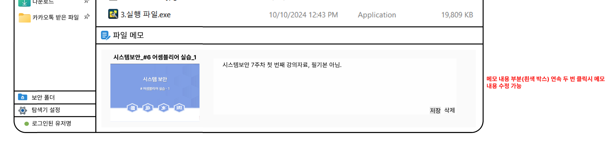
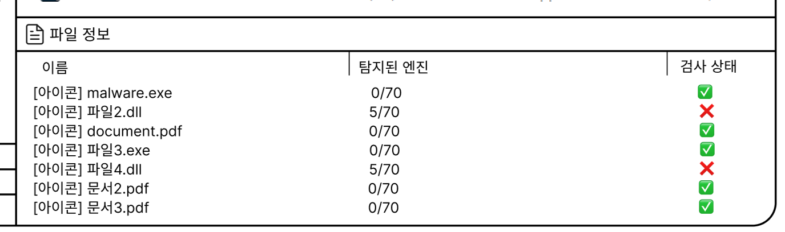
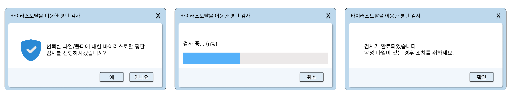
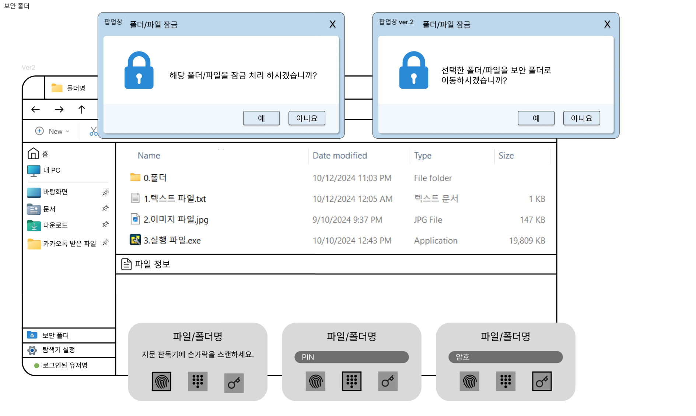
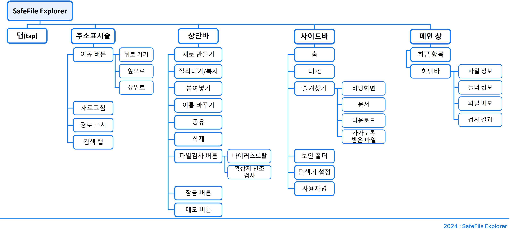

# SafeFile Explorer



## 프로젝트 개요
SafeFile Explorer는 보안 담당자들을 위한 파일 탐색기로, 보안 기능을 강화하여 악성 파일 식별 및 관리의 편리성을 높였습니다. 보안 담당자가 다루는 파일은 악성 파일과 정상 파일이 혼재되어 있으며, 실수로 악성 파일을 실행하는 상황을 방지하고, 파일을 열지 않고 빠르게 내용을 확인할 수 있는 기능을 제공합니다.

## 설계 의도
보안 담당자가 대량의 파일을 효율적으로 관리하고 악성 파일을 신속히 식별할 수 있도록 설계되었습니다. SafeFile Explorer는 다음과 같은 목적을 가지고 개발되었습니다:
- **악성 파일 실행 방지**: 파일 확장자 변조 여부 및 평판 검사를 통해 악성 파일을 판별합니다.
- **효율적 파일 관리**: 미리보기 기능으로 파일을 열지 않고도 내용을 확인할 수 있어 시간을 절약합니다.

## 핵심 기능
1. **파일 검사**: 파일 확장자 변조 및 평판 검사를 통해 악성 여부를 판별합니다.
2. **메모 기능**: 각 파일에 메모를 추가하여 보안 담당자가 파일 관련 정보를 관리할 수 있습니다.
3. **보안 폴더**: 비밀번호 보호 기능이 있는 보안 폴더를 생성하여 중요한 파일을 안전하게 보호합니다.
4. **미리보기**: 파일을 열지 않고 속성 및 내용을 빠르게 확인할 수 있습니다.

## 구현 기능
### **즐겨찾기 기능**
자주 사용하는 폴더를 즐겨찾기에 추가하여 빠르게 접근할 수 있습니다.



### **파일 미리보기**
파일의 속성과 내용을 미리 확인할 수 있는 기능입니다.




### **내용 검색**
파일 내 특정 내용을 검색할 수 있습니다.


### **히스토리 기능**
뒤로가기 기능을 통해 이전 작업으로 쉽게 돌아갈 수 있습니다.


### **메모 작성 및 표시**
각 파일에 대한 메모 작성 및 표시 기능을 제공합니다.



### **이중 확장자 공격 탐지**
문서 파일 위장 공격을 탐지하여 경고합니다.



### **평판 검사**
바이러스 검사 기능을 이용하여 파일의 안전성을 확인합니다.



### **보안 폴더**
비밀번호로 보호된 폴더를 통해 민감한 파일을 보호합니다.



## 설치 및 실행 방법[개발단계]
1. 저장소를 클론합니다:
   ```bash
   git clone https://github.com/Z00Honey/System-Security.git
   ```
2. 필요한 라이브러리를 설치합니다:
   ```bash
   pip install -r requirements.txt
   ```
3. 프로그램을 실행합니다:
   ```bash
   python main.py
   ```

## 설치 및 실행 방법[릴리즈]
1. exe 파일 실행

## 사용 예시
- **파일 검사**: 파일 선택 후 '검사' 버튼을 클릭하여 확장자 변조 여부와 평판 검사를 확인할 수 있습니다.
- **메모 추가**: 파일 상세보기에서 메모를 작성하고 저장하여 파일 관련 정보를 관리할 수 있습니다.
- **보안 폴더 생성**: '보안 폴더' 기능을 통해 비밀번호로 보호된 폴더를 만들고 중요한 파일을 저장합니다.


## 프로그램 흐름도



